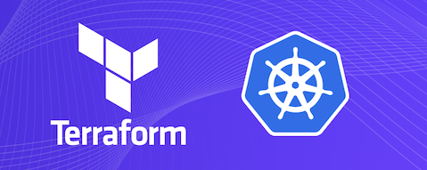

# Quest EKS Modules
This repository contains modules that are used to provision Kubernetes clusters and components.



```
├── argocd
│   └── argocd-application
│       └── templates
├── core-bootstrap
├── eks-core
├── helm
└── static
```

## Inventory
| Name | Description |
|---|---|
| [core-bootstrap](./core-bootstrap/README.md) | Bootstraps the cluster with ArgoCD and IRSA config |
| [argocd](./argocd/README.md) | Uses Helm and YAML manifests to provision ArgoCD and Apps |
| [eks-core](./eks-core/README.md) | Deploys EKS, Node Groups, and ArgoCD |
| [helm](./helm/README.md) | Helm helper module |